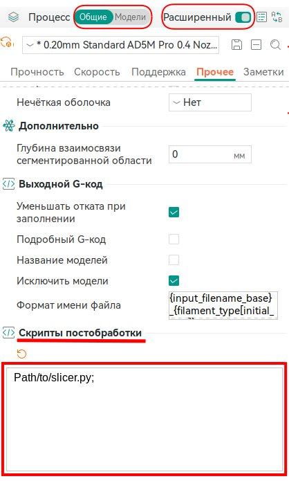
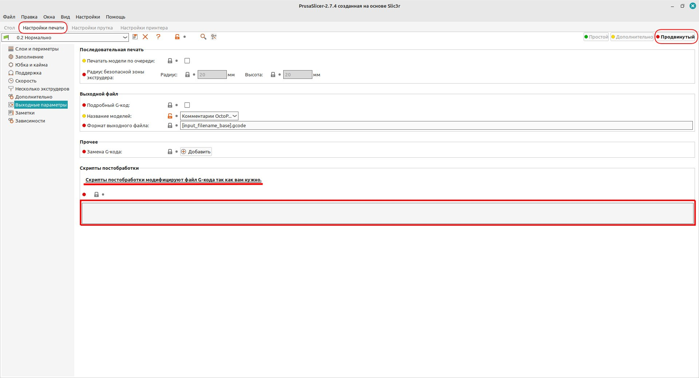
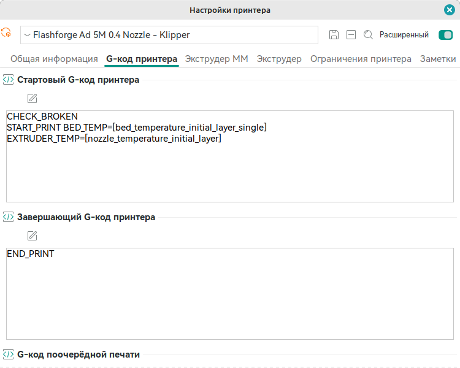
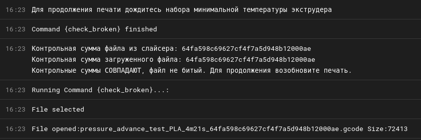

# Проверка на поврежденность загруженных файлов GCODE в Klipper

> Внимание! Скрипты проекта никаких изменений в готовый `GCODE` не вносят, а только добавляют в имя файла на стороне слайсера значение контрольной суммы. Скрипты настроены для работы с принтерами `CoreXY` (конкретно `Flashforge Ad 5M`), где положение "Дом" находится в нижней части. Для других принтеров необходимо править макрос в файле `checkbroken.cfg`. 
> 
> **Если Вы не уверены, что справитесь с процессом установки и настройки, лучше не беритесь.** Скрипт в процессе своей работы двигает печатающую голову и стол принтера, а именно отправляет все оси "Домой", затем немного приподнимает стол по оси Z, а также задает минимальную температуру экструдера для продолжения печати. Это все делается из-за команд "Пауза", "Продолжить печать" или "Отменить печать", которые Вы можете подать по результатам проверки файла.
> 
> При паузе принтер слегка опускает стол и переходит в режим ожидания. А при отмене печати отправляет ось Z вниз до "Дома". Если не приподнять стол, то он ударяется об низ принтера.

---

На некоторых 3D принтерах со слабым "железом", например `Flashforge Ad 5M`, при отправке файлов из слайсера по Wi-Fi, может произойти сбой загружаемого файла. Такое происходит очень редко, но тем не менее, не приятно. О произошедшем сбое владелец принтера узнает только в момент наступления сбоя. До этого момента может пройти много времени и принтер успеет отпечатать сотни грамм пластика, которые скорее всего отправятся в мусорную корзину.

Предлагамые здесь скрипты призваны предупреждать владельца принтера о загрузке файла со сбоем в самом начале печати. Во время проверки печать становится на паузу и дальнейшие действия зависят только от владельца, продолжать или прервать печать.

В общем случае, после установки и настройки, порядок действий будет следующим: Нарезка модели, перенос на принтер любым доступным способом, запуск на печать. Принтер "сходит" "Домой", встает на паузу и на консоли сообщается результат проверки контрольных сумм. Прочитав результат проверки Вы можете или отменить печать или продолжить. Дальше пойдет штатная работа принтера. Вы должны помнить и понимать, скрипты не предотвращают возникновение других ошибок в процессе печати.

Скрипты состоят из трех частей:

- файл `slicer.py` устанавливается на компьютере пользователя, где установлен любимый слайсер;

- файл `klipper.py` устанавливается в одной из папок, где установлен `Klipper`;

- файл `checkbroken.cfg` копируется в папку конфигураций `Klipper`.

> Скрипты работают только на принтерах под управлением `Klipper`. Могут работать и на прошивках, основанных на `Klipper`, если есть доступ к его папкам. Работа скриптов проверялась только на **[flashforge_ad5m_klipper_mod](https://github.com/xblax/flashforge_ad5m_klipper_mod)**. 
> 
> Автор готов сотрудничать по усовершенствованию предлагаемых скриптов, но ни в коем случае не несет ответственность за понесенный ущерб или другие неприятные последствия.

## Установка скриптов и конфигурационных файлов

### Установка и настройка скрипта klipper.py

Установку скриптов следует начинать с копирования скрипта `klipper.py` в папку `Klipper` и его настройки для работы. Если данный процесс не удастся провести, есть смысл прервать установку до выяснения путей решения данной проблемы.

> Ниже я буду приводить команды только для ОС `Linux`. Если кто-то захочет помочь с установкой из-под `Windows`, готов ее принять.

Открываем терминал, заходим по `SSH` в систему `Klipper`:

```shell
ssh root@192.168.1.50
```

где `root` означает имя пользователя, `192.168.1.50` - IP адресс принтера в локальной сети или в сети предприятия. Если `SSH` настроен по другому порту, не забудьте указать номер порта.
Вводим пароль пользователя и входим в систему. Видим приглашение к вводу команд. 

Переходим в папку `printer_data` и создаем папку `scripts` (Если Вы желаете хранить скрипт по другому пути, можно этот шаг пропустить) и входим в эту папку:

```shell
cd /Path/to/printer_data
mkdir scripts
cd scripts
```

где `/Path/to/printer_data` как правило находится в домашней папке текущего пользователя: `~/printer_data`

> Внимание! Все команды должны выполняться правами текущего пользователя. Никакого `sudo` не допускается.

Не закрывая текущее окно терминала, открываем новое окно. В новом окне терминала копируем скрипт `klipper.py` в систему `Klipper`:

```shell
scp /Path/to/scripts/klipper.py root@192.168.1.50:/Path/to/printer_data/scripts/klipper.py
```

где `/Path/to/scripts/klipper.py` путь к скрипту на Вашем компьютере, куда вы скачали скрипты с этого сайта, `/Path/to/printer_data/scripts` это путь созданной нами выше папки `scripts`. Смотрите предыдущий шаг.
Переходим в первое окно, где у нас открыт сеанс `SSH`. Задаем права скрипту на выполнение как программы:

```shell
chmod +x klipper.py
```

Если все, что рассмотрели выше, удалось и никаких ошибок не возникло, значит можно двигаться дальше. Самое тонкое место в процессе установки и настройки пройдено.

### Установка и настройка скрипта slicer.py

Далее Вы должны принять решение, где будете размещать скрипт `slicer.py` на Вашем компьютере. Если в папке, куда установлен слайсер, то вы рискуете потерять файл при обновлении или переустановке слайсера. Лучше всего определить отдельную папку и там хранить скрипты пост-обработки слайсера. Решать Вам. Дальше будем использовать путь типа `/Path/to/slicer.py`. 

После того, как определились с местом нахождения скрипта, скопируйте туда скрипт и задайте права на выполнение:

```shell
chmod +x slicer.py
```

Открываем слайсер. Переходим:

- **для `OrcaSlicer`**: Блок Процесс на главном экране приложения, переключатель "Общие/Модели" в "Общие", включаем галочку "Расширенный", переходим на вкладку "Прочее" и прокручиваем список настроек до самого низа, до блока "Скрипты постобработки";
  
  

- **для `PrusaSlicer`, `SuperSlicer`**: Кликаем по кнопке "Продвинутый", переключаемся на вкладку "Настройка печати", в списке пунктов кликаем по пункту "Выходные параметры". Находим блок "Скрипты постобработки"
  
  

> Других слайсеров у автора нет, но точно известно, что в слайсере `Cura` также есть возможность задать скрипты постобработки. Работа скрипта в слайсере `Cura` не гарантируется, но предполагается, что механизм работы постобработки во всех слайсерах одинаковый.

В текстовое поле введите абсолютный путь к скрипту как на картинке для OrcaSlicer. **Символ ";" в конце имени скрипта обязателен**.

Попробуйте загрузить в слайсер не сложную модель, запустить нарезку и сохранить на диск. Если слайсер выдает ошибку, внимательно проверьте соответствие указанного в настройках пути реальному местонахождению скрипта. При несоответствии устраните ошибку. Если ошибка не исчезает, проверьте права запуска скрипта. Владельцем файла должен быть текущий пользователь и должны быть заданы права на выполнение как программы. Еще одной из причин может быть неправильный путь запускающей программы в `Windows`. Поскольку там все не так, как надо, возможно придется исправить путь запуска `python` в среде `Windows`.

Если после всех этих проверок ошибка не исчезает, пишите, будем разбираться. А до этого момента очистите поле скрипта постобработки в слайсере.

Если все отработало правильно и сохранение нарезанного `GCODE` на диск удался, откройте папку, куда сохранили код и внимательно посмотрите на имя файла. Имя файла должно выглядеть так:

```shell
test_cube_f12f034bb0f602c5f66d77228d841476.gcode
```

Между именем файла из слайсера (`test_cube`) и расширением (`.gcode`) должна быть задана строка длиной в 32 символа (`f12f034bb0f602c5f66d77228d841476`). Длина 32 символа обязательна. Это и есть контрольная сумма. Длина 32 символа выбрана чисто из соображения не сильно удлинять длину имени файла. В настоящее время используется контрольная сумма `MD5`. 

> Автору известно, что технология `MD5` взломана и не рекомендуется ей пользоваться в криптографии. Поскольку эта технология в рамках скрипта в криптографических операциях не участвует, автор решил использование `MD5` допустимым. Вместо `MD5` можно использовать `SHA1` или другие технологии. Еще раз отмечаю, здесь и сейчас длина имени файла важнее.

В конце добавьте в стартовый GCODE принтера самой первой строкой макрос CHECK_BROKEN

 

### Установка и настройка файла конфигурации checkbroken.cfg

Открываем свой любимый веб менеджер (`Fluid` или `Mainsail`), переходим на страницу правки конфигов, кнопкой загрузки нового конфиг файла загружаем файл `checkbroken.cfg` в `Klipper`. Открываем файл `checkbroken.cfg` на редактирование. Проверяем правильность пути скрипта в блоке

```
[gcode_shell_command check_broken]
```

При необходимости исправляем. Процедура обязательная! Убедившись в правильности пути и в наличии права на выполнение скрипта `klipper.py`,  нажимаем кнопку "Сохранить и закрыть". Переходим в конфиг `printer.cfg`. В блоке импорта других конфигурационных файлов задаем с новой строки

```ini
[include checkbroken.cfg]  # Компонент проверки загруженных файлов на битость
```

Комментарий после знака # не обязателен.

Пробуем отправить со слайсера на печать какую-нибудь модель или загружаем ранее нарезанный и сохраненный на диске файл.

Принтер должен отправить все оси "Домой", затем приподнять стол примерно на 40 мм, печатающая голова должна занять позицию как при паузе. Одновременно с этим экструдер должен нагреваться до температуры 180 градусов (минимальная температура для команды "Возобновить печать").

А на консоли должны появиться похожие сообщения:


Второй сверху и нижние 3 сообщения это от системы. Причем третий снизу и второй сверху сообщает о начале и окончании запуска внешного скрипта. Обратите внимание на самое нижнее сообщение. В имени файла присутствует контрольная сумма длиной 32 символа. Третье сверху сообщение отображает результат работы скрипта. В приведенном изображении файл исправен и контрольные суммы со слайсера и загруженного в принтер файла совпали. Первое сообщение о необходимости подождать сообщает макрос после возвращения управления в `Klipper`.

Если возникла обшибка, посмотрите, в каком месте она отображается. Если за пределами сообщений `**Running Command {check_broken}...:**` и `**Command {check_broken} finished**`, значит это ошибки системы или макроса `CHECK_BROKEN`. А если между приведенными сообщениями, то это результат работы скрипта.

Если Вы справились, пользуйтесь! :)
